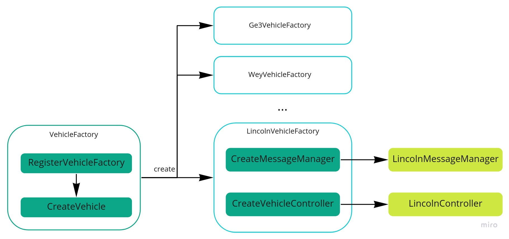
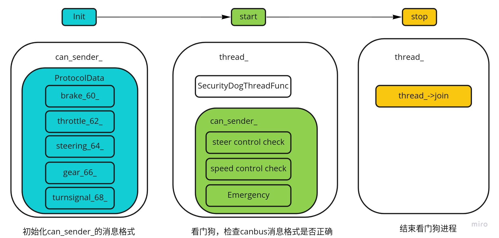
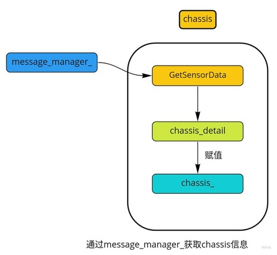
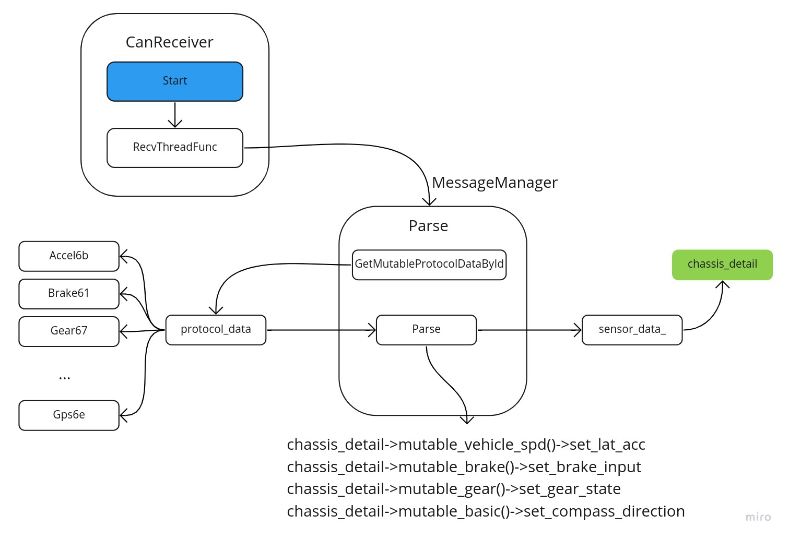
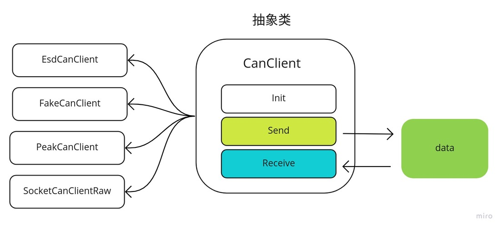

# Canbus

> 黑发不知勤学早，白首方悔读书迟。


## Canbus模块介绍
我们先看下什么是Canbus： 控制器局域网 (Controller Area Network，简称CAN或者CAN bus) 是一种车用总线标准。被设计用于在不需要主机（Host）的情况下，允许网络上的节点相互通信。采用广播机制，并利用标识符来定义内容和消息的优先顺序，使得canbus的扩展性良好，同时不基于特殊类型（Host）的节点，增加了升级网络的便利性。
这里的**Canbus模块其实可以称为Chassis模块**，主要的作用是反馈车当前的状态（航向，角度，速度等信息），并且发送控制命令到车线控底盘，**可以说Canbus模块是车和自动驾驶软件之间的桥梁**。由于这个模块和"drivers/canbus"的联系紧密，因此也一起在这里介绍。
Canbus模块是车和自动驾驶软件之间的桥梁，通过canbus驱动(drivers/canbus)来实现将车身信息发送给apollo上层软件，同时接收控制命令，发送给汽车线控底盘实现对汽车的控制。

那么canbus模块的输入是什么？输出是什么呢？

可以看到canbus模块：
* **输入** - 1. ControlCommand（控制命令）
* **输出** - 1. Chassis（汽车底盘信息）, 2. ChassisDetail（汽车底盘信息详细信息）

Canbus模块的输入是control模块发送的控制命令，输出汽车底盘信息，这里apollo的上层模块被当做一个can_client来处理，实现接收和发送canbus上的消息。

Canbus模块的目录结构如下：
```
├── BUILD                    // bazel编译文件
├── canbus_component.cc      // canbus主入口
├── canbus_component.h
├── canbus_test.cc           // canbus测试
├── common                   // gflag配置
├── conf                     // 配置文件
├── dag                      // dag依赖
├── launch                   // launch加载
├── proto                    // protobuf文件
├── testdata                 // 测试数据
├── tools                    // 遥控汽车和测试canbus总线工具
└── vehicle                  //
```
接着我们来分析下Canbus模块的执行流程。


## Canbus模块主流程
Canbus模块的主流程在文件"canbus_component.cc"中，canbus模块为定时触发，每10ms执行一次，发布chassis信息，而ControlCommand则是每次读取到之后触发回调"OnControlCommand"，发送"control_command"到线控底盘。
```c++
bool CanbusComponent::Proc() {
  PublishChassis();
  if (FLAGS_enable_chassis_detail_pub) {
    PublishChassisDetail();
  }
  return true;
}
```
由于不同型号的车辆的canbus命令不一样，在"/vehicle"中适配了不同型号车辆的canbus消息格式，所有的车都继承自Vehicle_controller基类，通过对Vehicle_controller的抽象来发送和读取canbus信息。


#### 车辆工厂模式(VehicleFactory)
在vehicle中可以适配不同的车型，而每种车型都对应一个vehicle_controller，创建每种车辆的控制器(VehicleController)和消息管理(MessageManager)流程如下：

VehicleFactory类通过创建不同的类型AbstractVehicleFactory，每个车型自己的Factory在创建出对应的VehicleController和MessageManager，用林肯来举例子就是： VehicleFactory创建LincolnVehicleFactory，之后通过CreateMessageManager和CreateVehicleController创建对应的控制器（LincolnController）和消息管理器（LincolnMessageManager）。
上述代码流程用到了设计模式的工厂模式，通过车辆工厂创造不同的车辆类型。


<a name="lincoln_controller" />

#### 车辆控制器(LincolnController)
下面以林肯来介绍LincolnController，以及如何接收chassis信息，其它的车型可以以此类推，下面主要分为2部分介绍，第一部分为controller的init->start->stop流程，第二部分为chassis信息获取：

可以看到control模块初始化(init)的过程获取了发送的消息的格式，通过can_sender应该发送那些消息，而启动(start)之后启动一个看门狗，检查canbus消息格式是否正确，最后关闭(stop)模块则是结束看门狗进程。


而chassis的获取则是通过message_manager_获取chassis_detail，之后对chassis进行赋值。


## Canbus(驱动程序)
上层的canbus就介绍完成了，而canbus的发送(CanSender)和接收(CanReceiver)，还有消息管理(MessageManager)都是在"drivers/canbus"中实现的。


#### 消息管理器(MessageManager)
MessageManager是如何获取消息的呢？

**MessageManager主要作用是解析和保存canbus数据，而具体的接收和发送则是在"CanReceiver"和"CanSender"中**，拿接收消息举例子，也就是说CanReceiver收到消息后，会调用MessageManager中的parse去解析消息，消息的解析协议在"modules/canbus/vehicle/lincoln/protocol"中，每个消息把自己对应的信息塞到"chassis_detail"中完成了消息的接收。



#### 消息接收(CanReceiver)
canbus消息的接收在上面有介绍，在CanReceiver中的"Start"调用"RecvThreadFunc"实现消息的接收，这里会启动一个异步进程去完成接收。
```c++
template <typename SensorType>
::apollo::common::ErrorCode CanReceiver<SensorType>::Start() {
  if (is_init_ == false) {
    return ::apollo::common::ErrorCode::CANBUS_ERROR;
  }
  is_running_.exchange(true);

  // 启动异步接收消息
  async_result_ = cyber::Async(&CanReceiver<SensorType>::RecvThreadFunc, this);
  return ::apollo::common::ErrorCode::OK;
}
```
RecvThreadFunc通过"can_client_"接收消息，然后通过"MessageManager"去解析消息，在MessageManager中有讲到。
```c++
template <typename SensorType>
void CanReceiver<SensorType>::RecvThreadFunc() {

  ...
  while (IsRunning()) {
    std::vector<CanFrame> buf;
    int32_t frame_num = MAX_CAN_RECV_FRAME_LEN;

    // 1. can_client_接收canbus数据
    if (can_client_->Receive(&buf, &frame_num) !=
        ::apollo::common::ErrorCode::OK) {

      cyber::USleep(default_period);
      continue;
    }
    ...

    for (const auto &frame : buf) {
      uint8_t len = frame.len;
      uint32_t uid = frame.id;
      const uint8_t *data = frame.data;

      // 2. MessageManager解析canbus数据
      pt_manager_->Parse(uid, data, len);
      if (enable_log_) {
        ADEBUG << "recv_can_frame#" << frame.CanFrameString();
      }
    }
    cyber::Yield();
  }
  AINFO << "Can client receiver thread stopped.";
}
```


#### 消息发送(CanSender)
消息发送对应的是在CanSender中的"Start"调用"PowerSendThreadFunc"，我们可以看具体实现:
```c++
template <typename SensorType>
common::ErrorCode CanSender<SensorType>::Start() {
  if (is_running_) {
    AERROR << "Cansender has already started.";
    return common::ErrorCode::CANBUS_ERROR;
  }
  is_running_ = true;

  // 启动线程发送消息
  thread_.reset(new std::thread([this] { PowerSendThreadFunc(); }));

  return common::ErrorCode::OK;
}
```
PowerSendThreadFunc再通过"can_client"发送消息：
```c++
      std::vector<CanFrame> can_frames;
      CanFrame can_frame = message.CanFrame();
      can_frames.push_back(can_frame);

      // 通过can_client发送消息
      if (can_client_->SendSingleFrame(can_frames) != common::ErrorCode::OK) {
        AERROR << "Send msg failed:" << can_frame.CanFrameString();
      }
```


#### canbus客户端(CanClient)
CanClient是canbus客户端，同时也是canbus的驱动程序，针对不同的canbus卡，对发送和接收进行封装，并且提供给消息发送和接收控制器使用。

拿"EsdCanClient"来举例子，发送在"Send"函数中，调用的是第三方的硬件驱动，目录在"third_party/can_card_library/esd_can"，实现can消息的发送：
```c++
ErrorCode EsdCanClient::Send(const std::vector<CanFrame> &frames,
                             int32_t *const frame_num) {
  ...

  // canWrite为第三方库的硬件驱动，third_party/can_card_library/esd_can
  // Synchronous transmission of CAN messages
  int32_t ret = canWrite(dev_handler_, send_frames_, frame_num, nullptr);
  if (ret != NTCAN_SUCCESS) {
    AERROR << "send message failed, error code: " << ret << ", "
           << GetErrorString(ret);
    return ErrorCode::CAN_CLIENT_ERROR_BASE;
  }
  return ErrorCode::OK;
}
```
其他的can卡可以参考上述的流程，至此整个canbus驱动就分析完成了。


## Reference
[Controller Area Network (CAN BUS) 通訊​協定​原理​概述](https://www.ni.com/zh-tw/innovations/white-papers/06/controller-area-network--can--overview.html)
